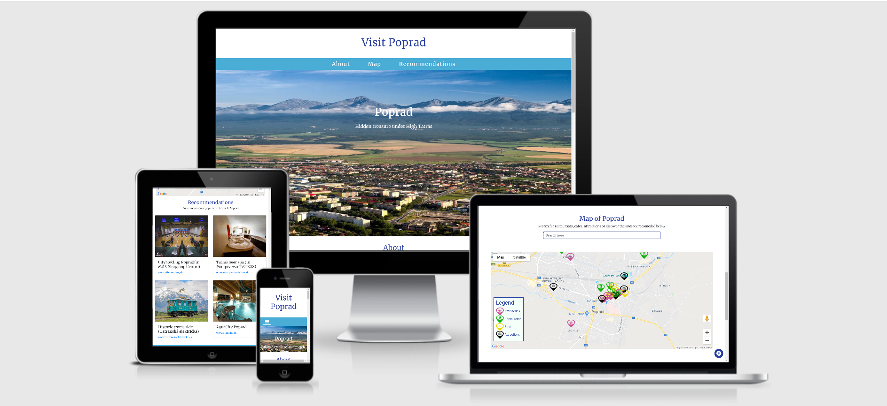

# Visit Poprad | Tourims information site 

**Live demo of this site [**can be found here**](https://janabuckova.github.io/Visit-Poprad/)**.

------

# Table of Contents

* [UX](#UX)
  * [Website Goals](#Website-Goals)
  * [User Stories](#User-Stories)
  * [Design Choices](#Design-Choices)
  * [Wireframes](#Wireframes)
* [Features](#Features)
  * [Existing Features](#Existing-Features)
  * [Future Features](#Future-Features)
* [Technologies Used](#Technologies-Used)
* [Testing](#Testing)
  * [Bugs](#Bugs)
* [Deployment](#Deployment)
* [Credits](#Credits)
  * [Media](#Media)
  * [Content](#Content)
  * [Source of code](#Source-of-codes)
  * [Acknowledgements](#Acknowledgements)
  * [Disclaimer](#Disclaimer)

------

## UX

### Website Goals

The purpose of the website is to provide tourists basic information about [Poprad](https://en.wikipedia.org/wiki/Poprad) 
in Slovakia. The main feature of Google search map together recommended places of interest such as restaurants,
 patisseries, bars and attractions already populated on the map. From the many activities Poprad has to offer 
 the most popular ones are included on the site with links to corresponding websites for more information. 
 Another feature offered is sign up for the newsletter so the tourists can be notified about new activities and attractions.

### User Stories

* As a user of the site I want a site that is easy to navigate
* As a tourist I want  a website which shows some recommended 
activities and places to visit  so I don’t have to do too much 'Googling'
* As a user I want a site that has functional map with search 
option, so I don’t have to switch between separate windows
* As a potential tourist or satisfied tourist I would like an option to receive 
news about upcoming events and interesting activities 

### Design Choices

* The sites navigation is intended to be simple with the usual navigation bar on the top
* The colours I initially chose were supposed to represent the tricolour of Slovakian flag but 
at the end I have decided not to use red colour as the overall overall design would be overpoverd by red.
I have used two shades of blue and white
* The font used was Merriweather as it is easy to read  

### Wireframes

Wireframes for this project were created at the beginning of the project using [Balsamiq](https://balsamiq.com) I have decided
to leave out the weather widget feature and instead included secction wiht reommneded atractions and newsletter sign up

Wireframes can be found at the below location

* [Desktop](https://github.com/JanaBuckova/Visit-Poprad/blob/master/wireframes/MS2_desktop.png)
* [Tablet](https://github.com/JanaBuckova/Visit-Poprad/blob/master/wireframes/MS2_tablet.png)
* [Mobile](https://github.com/JanaBuckova/Visit-Poprad/blob/master/wireframes/MS2_mobile.png)

------

## Featuress

### Existing Features

* **Navigation Bar** - Responsive navigation bar that enables the user to navigate through the site. 
Upon clicking on each of the navigation links, user is taken directly to that section of the site.
* **About Section** - Provides user with brief commentary about Poprad
* **Map Section** - Responsive and partially interactive section containing map with search box which 
enables user to search for places on interest which will be then shown on the map by means of a marker. 
- Another feature within the map section are map markers which show the user the recommended patisseries 
  (which in my opinion should be an absolute ‘must try’ on any visitors list), restaurants, bars and attractions. 
  The markers are organised by colour and stored on a map legend for clarity. Upon clicking each custom marker 
  on the map an information window appears showing image and address of each place. Already opened windows will 
  close when another one (or map area) are clicked.
* **Recommendations Section** - A section containing cards with different types of attractions for 
visitors/tourists to experience. The Cards are interactive and upon hovering over and out more information 
about each place appears/disappears. This section is also responsive and the cards are displayed appropriately depending on the device.
* **Subscribe Form** - Allows user to subscribe to a newsletter to receive latest updates
* **Social Media Links** - Allow users to stay connected on social media 

### Future Features
There are few more features withing the map are I would like to implement to provide similar experience to the user as usual Google map does.

* **Show users location on the map** - So the users can see which amenities and recommended places are within their vicinity.
* **Interactive map legend** – Users can click on each category and relevant recommended places will appear/disappear.
* **Information windows for places searched** – After a custom search (e.g. for a hotel) users will be able to click on each 
marker that appeared on the map and information window will appear.
* **Link Google ratings and place information to every marker** – After clicking on each type of marker (custom or from Google search) 
I would like to link information from Google map API, which I was unable to do in this project.

------

## Technologies Used

* [HTML5](https://en.wikipedia.org/wiki/HTML5)
  - This project used HTML5 for building the structure of the site
* [CSS3](https://en.wikipedia.org/wiki/Cascading_Style_Sheets) 
  - This project used CSS3 for styling of the site
* [JavaScript](https://www.javascript.com/)
  - This project used JavaScript to provide the interactivity for the website
* [jQuery](https://jquery.com/)
  - This project used jquery for Bootstrap plugins and make feature interactive
* [Bootstrap](https://getbootstrap.com/) 
  - This project used Bootstrap - CSS framework responsiveness of the site, including JavaScript plugins
* [Google Fonts](https://fonts.google.com/) 
  - This project used Google Fonts library for customised font
* [Google Maps API](https://developers.google.com/maps/documentation)
  - The project used the Google Maps API to provide the interactive Google Maps 
* [EmailJS](https://www.emailjs.com/)
  - The project used the EmailJS to enable a functional contact form.
* [Font Awesome](https://fontawesome.com/) 
  - This project used Font Awesome icon toolkit for Social Media Logos, Toggle icon
  and Back to top toggle button 
* [GitPod](https://code.visualstudio.com/) 
  - This project used GitPod - IDE for local development
* [GIT](https://git-scm.com/) 
  - This project used GitPod for version control
* [GitHub](https://github.com/) 
  - This project used GitHub for hosting the repository and the live website preview

### Testing tools

* [Chrome DevTools](https://developers.google.com/web/tools/chrome-devtools) 
* [Auto-prefixer](https://autoprefixer.github.io/) to ensure the css has all prefixes it needs, in order to work properly on
    all modern browsers. 
* [W3C CSS validation](https://jigsaw.w3.org/css-validator/) to validate CSS. 
* [W3C Markup Validation](https://validator.w3.org/) to validate HTML code.
* [JSHint](https://jshint.com/) to validate the JavaScript code

------

## Testing

 

### Bugs

---

## Deployment

To deploy this page to GitHub Pages from [its GitHub repository](https://github.com/JanaBuckova/Visit-Poprad), the following steps were taken:

1. On GitHub, navigate to the site's repository.
2. Under the repository name, click on **Settings**.
3. Scroll down to the **GitHub Pages** section.
4. Under **Source** click the drop-down menu labelled **None** and select **Master Branch**.
5. On selecting **Master Branch** the page is automatically refreshed, the website is now deployed.
6. Scroll back down to the **GitHub Pages** section to retrieve the link to the deployed website.
7. A green box should appear with the following message 
Your site is published at `https://github.com/JanaBuckova/Visit-Poprad`

For more information on how to deploy a website on GitHub, [please visit this website](https://help.github.com/en/github/working-with-github-pages/configuring-a-publishing-source-for-your-github-pages-site).

### How to run this project locally

To clone this project from GitHub:

1. On GitHub, navigate to the main page of the repository.
2. Under the repository name, click the green button **Clone or download**.
3. In the **Clone with HTTPs** section, copy the clone URL for the repository.
4. Open Terminal.
5. Change the current working directory to the location where you want the cloned directory to be made.
6. Type `git clone`, and then paste the URL you copied in Step 3.
   `git clone https://github.com/JanaBuckova/Visit-Poprad`
7. Press **Enter**. Your local clone will be created.

For further reading and troubleshooting on cloning a repository [from GitHub](https://help.github.com/en/github/creating-cloning-and-archiving-repositories/cloning-a-repository).

---

## Credits

### Media

The photos used in this site were obtained from:
 * [Shutterstock](https://www.shutterstock.com/home) - Jumborton image of Poprad with view of High Tatras
 * [Logomakr](https://logomakr.com/) - Custom map markers created by me using inbuilt Library
 * Remaining imeges were obtained from differnt social platforms
 * [TinyJPG](https://tinyjpg.com/) - Used to compress images
 * [Simple Image Resizer](http://www.simpleimageresizer.com) - Used to resize images

### Content
The content on the cards was copied from english version of [Visit Poprad](https://www.visitpoprad.sk/)
site with slight adjustmnets for English native speakers.

README reference for deployment was copied from [this](https://github.com/D0nni387/Luxury-Door-Solutions/blob/master/README.md) readme file by former User-Centric-Frontend Slack channel lead Richard.

### Source of code
Official Google documentation for [Maps JavaScript API ](https://developers.google.com/maps/documentation/javascript/overview) 
and [Place Search](https://developers.google.com/places/web-service/search). The course content of lesson covering Sending Emails 
Using [EmailJS](https://www.emailjs.com/) was used for working functionality of the 
newsletter subscribe form. The remaining references are stated in comments in the code.

--- 

### Acknowledgements

I received inspiration for this project from an actual tourist site on my hometown [Visit Poprad](https://www.visitpoprad.sk/)
which contains many more features.

I would like thank the tutor support of [Code Institute](https://codeinstitute.net/) namely Michael who helped me with solving one on my many bugs.
Of course a big thank you to my mentor Precious Ijege for the amazing advice and support.

### Disclaimer
This site was created for educational purposes. Many images were obtained 'In a good faith' from different social media platforms or 
official websites and are not meant for reuse.